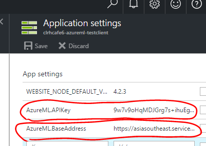

# [#clrhcafe6](https://twitter.com/search?f=tweets&vertical=default&q=%23clrhcafe6&src=typd) - AzureML Test Client (Web App)

After deploy it, you should configure follow application configurations to connect your Azure Machine Learning Web service which you built.

- `AzureML.APIKey`
- `AzureML.BaseAddress`

----

## Live Demo

### URL

[http://clrhcafe6-azureml-testclient.azurewebsites.net/](http://clrhcafe6-azureml-testclient.azurewebsites.net/)

### Sample Pictures

You can test above Live Demo site with following sample pictures.  
(After you downloaded these pictures into your local disk, you can upload these pictures to the live demo site and try it.)

- sample-04.png 
- sample-05.gif 
- sample-06.jpg 

